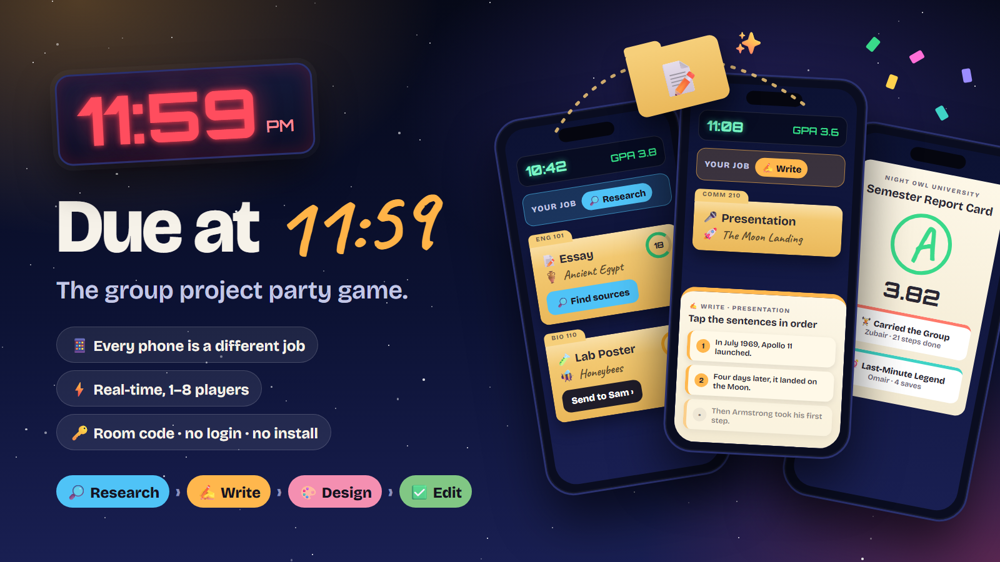

# Due at 11:59

**The group project party game.** It's 8:00 PM and your group project is due at 11:59. Every phone is a different job on the same project, and the work literally slides from one phone to the next.



**▶ Play it now: https://due-at-1159.due-at-1159.workers.dev**

No login, no install. 1–8 players on any phone or laptop. Bots fill empty seats, so you can also play alone.

## How to play

1. **Everyone gets a job:** 🔎 Research, ✍️ Write, 🎨 Design or ✅ Edit.
2. **Folders land on your desk.** Each one shows the steps it needs and a countdown.
3. **Your step? Do it.** Solve a quick task:
   - 🔎 **Research:** pick the sources you can actually trust.
   - ✍️ **Write:** put the sentences in the right order.
   - 🎨 **Design:** choose the right chart for the data.
   - ✅ **Edit:** catch the typo before the professor does.
4. **Not your step? Pass it** to whoever has that job. The folder flies to their phone.
5. **Submit before midnight.** The earlier you submit, the better the grade.

Then the chaos starts: a pretend Wi-Fi outage, an exploding group chat, the professor moving the deadline up, a printer jam, or everyone's roles getting swapped. At 11:59 PM the group gets a report card with a GPA, a transcript and an award for every player.

## Features

- **Real-time multiplayer:** join with a 4-letter room code, invite link or QR code; every screen stays in sync.
- **Rival bots:** race "The Overachievers", a rival bot group, at Easy, Medium or Hard, with a live tug-of-war score bar.
- **Four difficulty levels** (Freshman to Senior) and 2, 3 or 4½ minute rounds.
- **60-second practice round:** slower timers, no chaos events or rivals, a tip on every task, and a grade that doesn't count.
- **Fair timers:** groups of 3 get 20% more time per folder, and groups of 2 or 5 get 5% more. In 20,480 simulated rounds, groups of 3 had the hardest time; a 300-round A/B test showed the boost raises their average GPA by 0.18 to 0.39 while groups of 4 stay the same.
- **Built for phones:** big tap targets, sound effects, study music and vibration.
- **Resilient rooms:** players who drop out can rejoin, their folders are shared out meanwhile, and the host role hands off automatically.
- **Built-in instructions** with tabs for the basics, jobs, chaos events and grading.

## How it works

- **Server:** a [Cloudflare Worker](https://developers.cloudflare.com/workers/) with one [Durable Object](https://developers.cloudflare.com/durable-objects/) per room. The room owns the game state and runs the clock, so every player sees the same thing.
- **Game engine:** [`src/game.js`](src/game.js) is plain JavaScript with no platform code, so it runs the same in the Durable Object and in Node tests. Content and tuning live in [`src/content.js`](src/content.js).
- **Client:** vanilla JavaScript, HTML and CSS in [`public/`](public/). Sounds and music are synthesized with the Web Audio API, so there are no audio files.

## Run it locally

You need [Node.js](https://nodejs.org/) 20 or newer.

```bash
npm install
npm run dev
```

Then open http://localhost:8787.

```bash
npm test
```

This plays full simulated rounds against the engine: 1–8 players, every difficulty, drop-outs and rejoins, bots and rivals.

## Deploy

```bash
npx wrangler login
npm run deploy
```

This publishes to your own Cloudflare account on the free plan.
